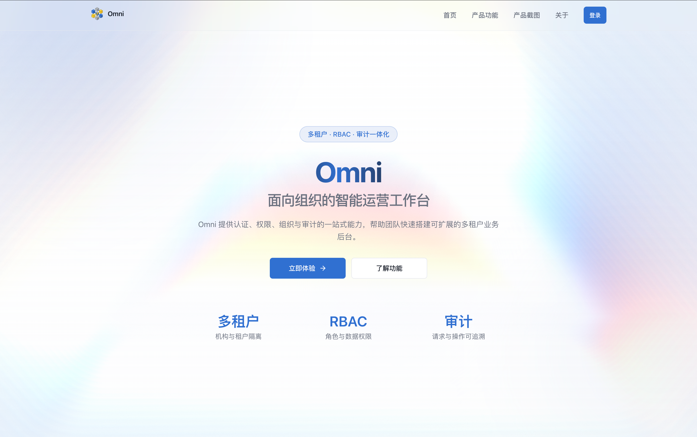
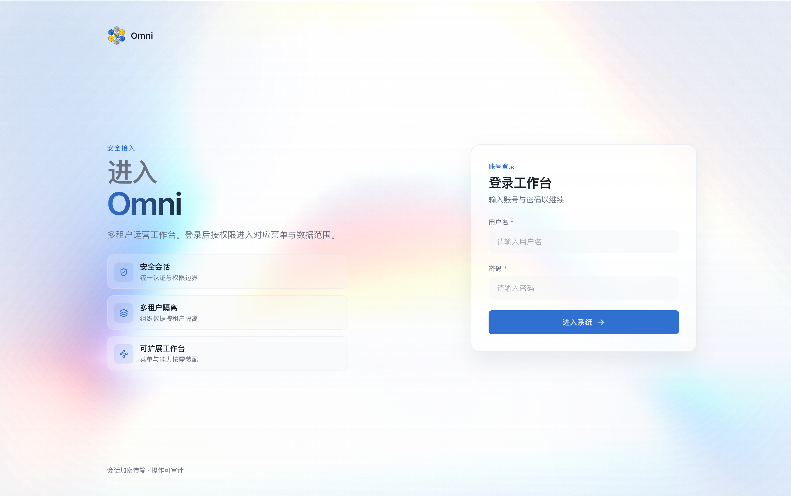
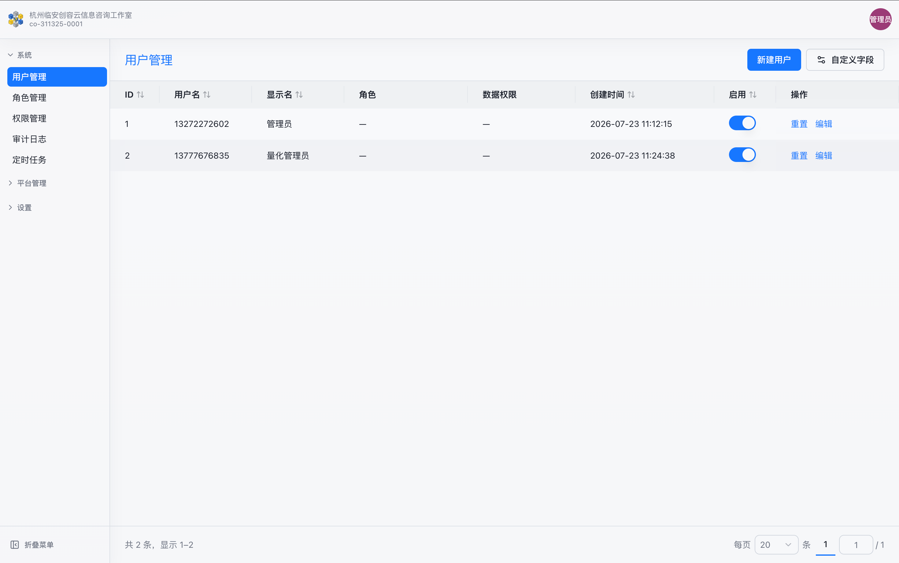
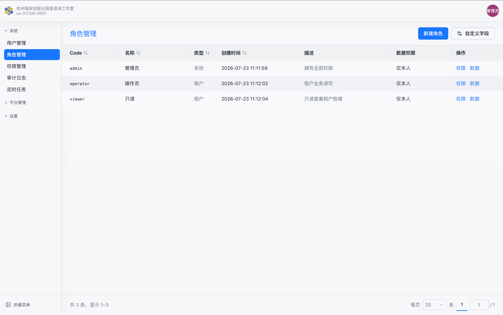
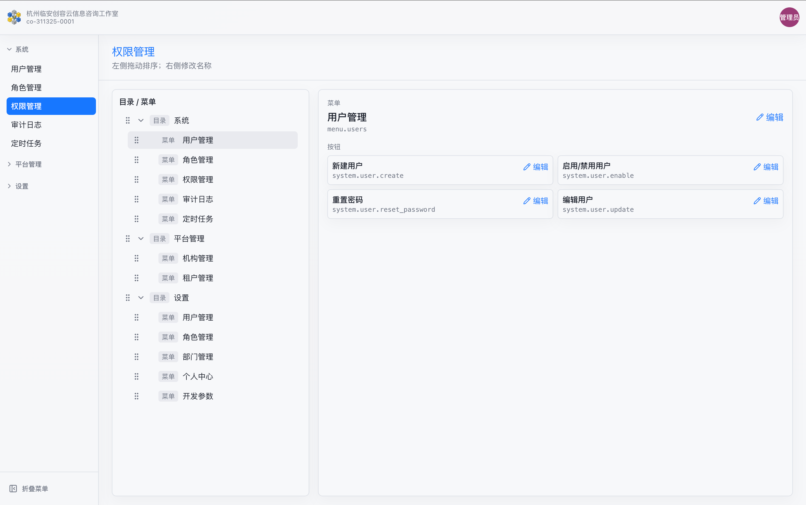
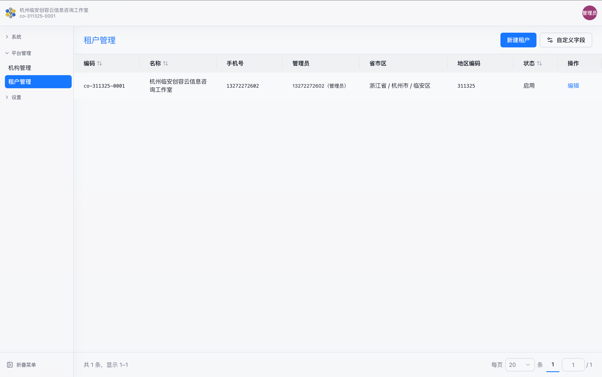
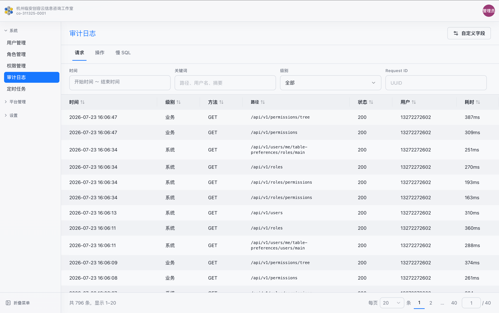
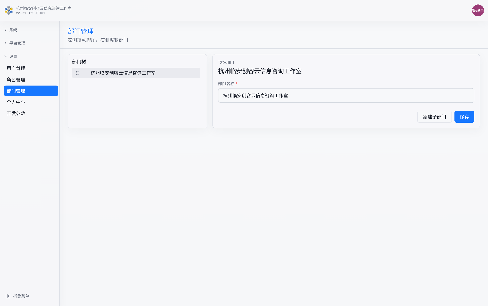
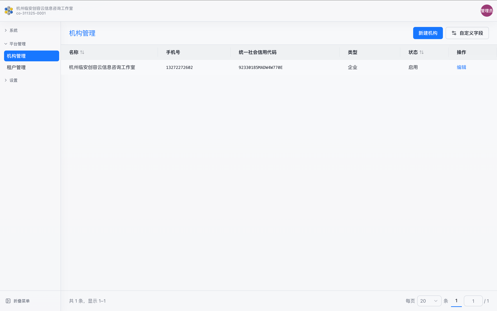
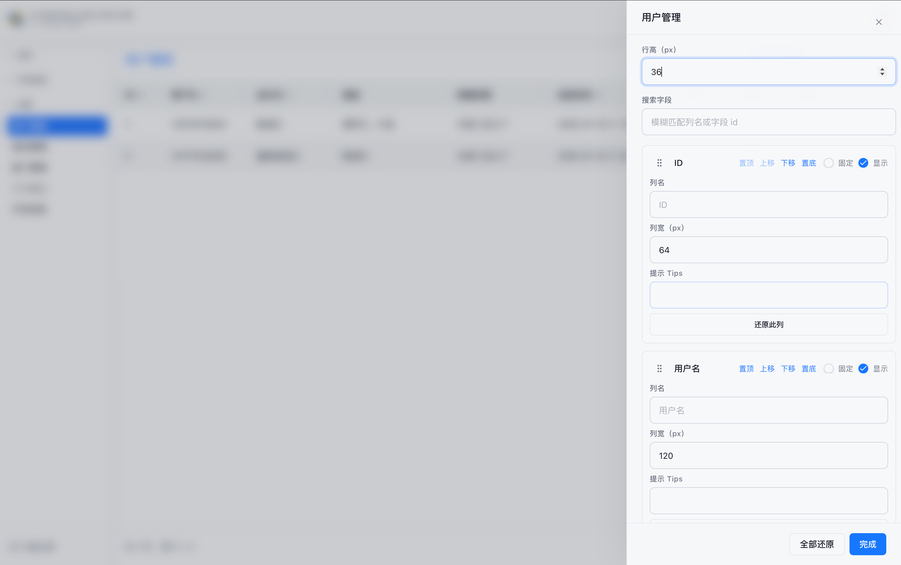

# Omni

<p align="center">
  <strong>一套底座，覆盖 App · Web · 桌面端 · SaaS</strong><br />
  从 0 到 1，撑到百万用户规模 — Omni Synth 开源底座
</p>

我们相信：软件不该只属于会写代码的人，好产品也不该卡在「后台怎么搭」这一关上。无论您做 App、Web、桌面端还是 SaaS，真正决定成败的，是客户要什么、体验是否打动人、业务如何持续创新——而不是再把几个月耗在登录、组织架构、权限边界与操作审计上。这些复杂能力本该一次做对、长期复用，成为所有产品共用的底座。Omni 正是 Omni Synth 开源底座：拆掉从 0 到 1 的门槛，让想法直接长成可上线的生产级后台，并按可服务百万用户的规模去生长。连锁门店、教育医疗、律所物业、跨境电商与加盟 SaaS……形态不同，底座相同；您负责故事与增长，我们兜住组织、权限与可追溯。把复杂的事留给我，您专注于业务与创新；让交付可验收、可运营、可追溯，而不是停在好看却上不了线的演示。这是我们对「生产级交付」的承诺，也是 Omni 存在的理由。

<p align="center">
  <a href="https://omni-python-web-template.irez.cn"><strong>在线预览 →</strong></a>
  · <a href="https://omni.irez.cn"><strong>Omni 理念</strong></a>
  · <a href="#适合谁"><strong>适合谁</strong></a>
  · <a href="#产品介绍"><strong>看能力</strong></a>
  · <strong>⭐ Star</strong>
</p>



| 从 0 到 1 | 多组织可运营 | 可追溯可交付 |
|:---:|:---:|:---:|
| **想法直接落地成后台** | **租户 / 机构 / 部门隔离** | **权限到按钮，操作可审计** |

---

## 适合谁

**App、Web、桌面端、SaaS —— 这一套够你从零启动，并按百万用户规模去长。**

| 形态 | 你在做什么 | 典型行业场景 |
|---|---|---|
| **移动 App** | App 背后的管理中台、运营台、客服台 | 本地生活团购运营台 · 教育 App 教务后台 · 医疗问诊预约管理 |
| **Web 应用** | 浏览器里就能用的业务系统 | 连锁门店进销存 · 律所案件协作平台 · 物业报修与收费中台 |
| **桌面端** | 安装包应用背后的账号与权限体系 | 设计工作室项目管理 · 工厂产线质检台账 · 影楼订单与档期管理 |
| **SaaS** | 一套产品卖给很多家客户 | 跨境电商多店铺中台 · 连锁餐饮加盟 SaaS · 人力资源外包租户台 |

理念见 [omni.irez.cn](https://omni.irez.cn)：让想法成为可上线的生产级应用，而不是停留在演示。

---

## 产品介绍

从登录接入到权限治理、组织运营与审计追溯 — **开箱即用，所见即所得。**

| | |
|:---|:---|
| **01 · 统一认证登录**<br /><br />账号密码登录、会话鉴权与多租户切换。<br />进入工作台即可按权限开展业务 — 无需再从零搭登录页。 |  |

| | |
|:---|:---|
|  | **02 · 用户与组织管理**<br /><br />用户、部门、机构一体化维护。<br />启用状态、数据权限与组织树结构一次配齐，团队扩容不慌。 |

| | |
|:---|:---|
| **03 · 角色与功能权限**<br /><br />基于 RBAC 分配菜单与按钮权限。<br />可见范围与操作能力精细可控 — 安全边界清晰，交付更有底气。 |  |

| | |
|:---|:---|
|  | **04 · 权限目录编排**<br /><br />目录、菜单、按钮分层管理。<br />权限码同步与可视化分配，权限体系可演进、可复用。 |

| | |
|:---|:---|
| **05 · 租户与机构运营**<br /><br />平台侧管理租户开通与机构信息。<br />多组织并行运营不是「以后再说」，而是现在就能用。 |  |

| | |
|:---|:---|
|  | **06 · 审计与可观测**<br /><br />请求与操作日志留痕。<br />异常可追溯、合规可审查 — 上线后少踩坑、出事能复盘。 |

---

## 更多界面

| 部门管理 | 机构管理 | 自定义字段 |
|:---:|:---:|:---:|
|  |  |  |
| 树形部门结构，支撑数据范围与组织协作。 | 机构档案与管理员绑定，一站式开通租户环境。 | 列表字段可配置展示，贴合不同业务查看习惯。 |

---

## 为什么选 Omni？

| 你担心的 | 这套底座替你兜住 |
|---|---|
| 想法很好，但后台从零搭太慢 | App / Web / 桌面 / SaaS 共用同一底座，先上线再长业务 |
| 多客户、多门店一混就乱 | 租户与组织隔离，权限到按钮，数据边界清晰 |
| 出事说不清谁改过什么 | 请求与操作可追溯，交付与合规更有底气 |
| 演示好看，上线不够用 | 对齐 [Omni Synth](https://omni.irez.cn) 理念：生产级交付，不是半成品 |

<p align="center">
  <a href="https://omni-python-web-template.irez.cn"><strong>先点开预览感受一下 →</strong></a><br />
  <sub>喜欢就 Star，收藏这份从 0 到 1 的底座</sub>
</p>

---

## 快速开始

```bash
uv sync
nvm use node
cd web && npm install && npm run build
uv run main.py
```

浏览器打开 `http://localhost:8000/` 看宣传首页，或 `/login` 进入系统。首次使用先写入管理员：

```bash
OMNI_PROFILE=local uv run scripts/seed_admin.py
```

详见 [interfaces.md](docs/interfaces.md)。开发时可在 `web/` 下 `npm run dev`（Vite 代理 `/api`）。

## AI 规则

跨工具约定见 [AGENTS.md](AGENTS.md)（唯一规则源）。

## 文档

- [架构](docs/architecture.md)
- [数据存储](docs/data-stores.md)
- [应用时间 UTC](docs/datetime.md)
- [入口与 API](docs/interfaces.md)
- [多租户](docs/multitenant.md)
- [RBAC](docs/rbac.md)
- [审计日志](docs/audit-logging.md)
- [Web 主题](docs/web-theme.md)
- [Web 表单与错误反馈](docs/web-forms.md)
- [Web 表格与列偏好](docs/web-tables.md)
- [Web 客户端状态与本地存储](docs/web-client-state.md)
- [Web 页面目录规范](docs/web-pages.md)
